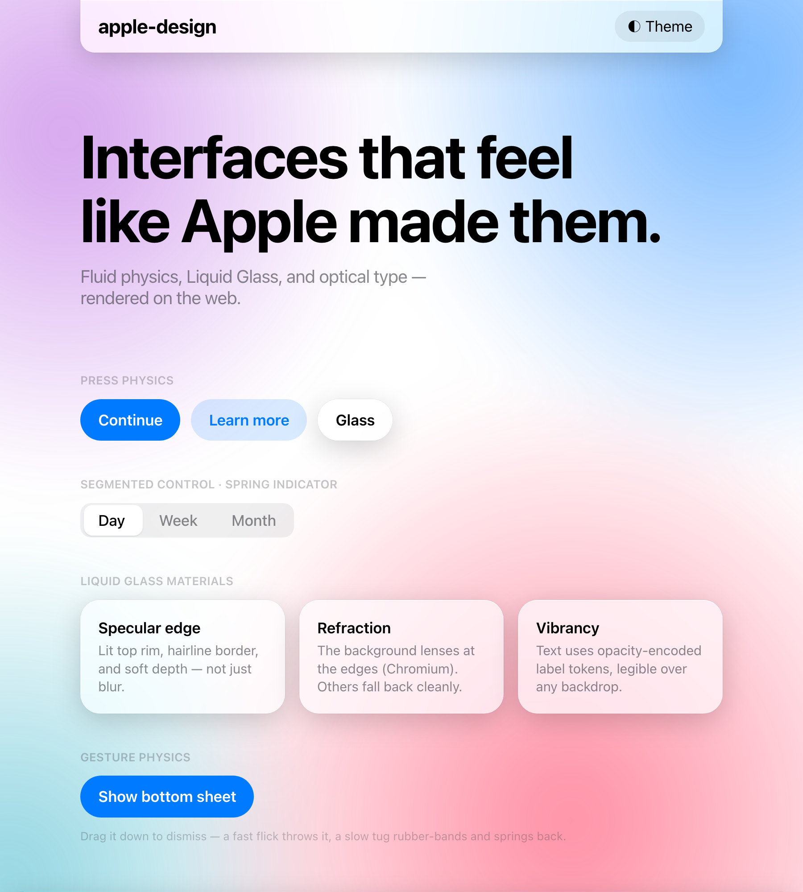
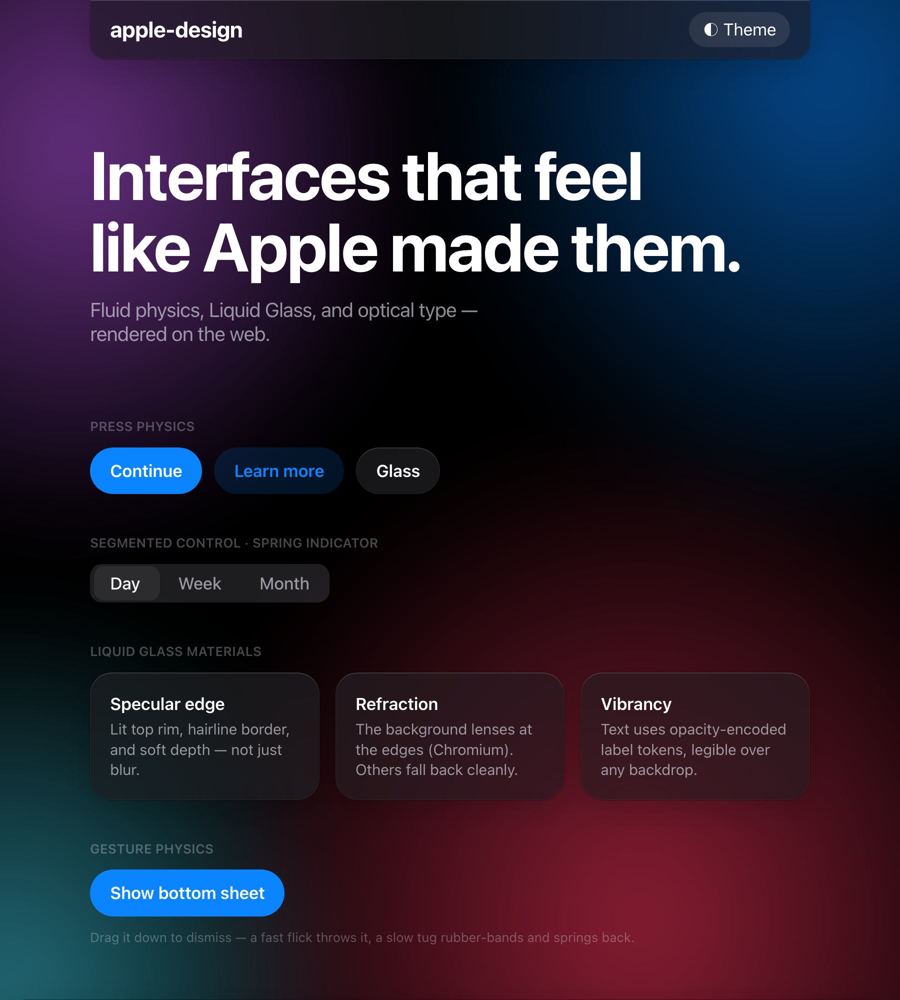

# apple-design

A Claude/agent **Skill** for building web interfaces with Apple's real fit and
finish — fluid physics-based motion, Liquid Glass materials rendered in CSS+SVG,
SF typography optics, a drop-in design-token layer, and complete copy-paste
components. Web-first (HTML/CSS/JS, React, Vue, Tailwind) and build-first.

## Preview

<table>
<tr>
<td width="50%"></td>
<td width="50%"></td>
</tr>
</table>

Liquid Glass nav and cards over a live gradient, SF typography optics, a
spring-driven segmented control, and a gesture-physics bottom sheet — in light
and dark. Rendered from [`demos/index.html`](demos/index.html); serve the folder
and open `/demos/index.html` (append `?theme=dark` to force a theme).

## Why this one

The field is full of Apple **HIG reviewers** (SwiftUI-semantic, no build code)
and one strong web builder (Emil Kowalski's `apple-design`). This skill matches
the motion rigor of the best and adds the three things every prior skill leaves
open:

- **Liquid Glass as rendered web code** — layered translucency + saturation +
  specular highlight + hairline rim + SVG refraction, with correct fallbacks.
  Nobody else ships this for the web.
- **First-class GSAP** — Flip shared-element transitions, ScrollTrigger pinned
  sequences, SplitText headline reveals, Draggable+Inertia — all Apple-tuned.
  Every competitor is Motion-only or has no motion at all.
- **A drop-in Apple token layer + complete components** — real Apple colors,
  type scale, spacing, radii, shadows, dark mode, and shippable parts (glass
  nav, spring bottom sheet, segmented control, toasts, popovers).

Plus zero runtime dependencies — a self-contained SKILL.md + references, no
MCP/CLI/CSV to install.

## Layout

```
apple-design/
├── SKILL.md                    # mental model, decision guides, routing
├── references/
│   ├── tokens.md               # the design-token system + squircles
│   ├── liquid-glass.md         # Liquid Glass / materials as CSS+SVG
│   ├── motion-physics.md       # the Apple fluid-motion model (library-agnostic)
│   ├── motion-dev.md           # Motion (motion.dev) cookbook
│   ├── gsap.md                 # GSAP cookbook (Flip, ScrollTrigger, SplitText…)
│   ├── typography.md           # SF optics: tracking, leading, optical sizing
│   └── components.md           # copy-paste components
├── assets/
│   ├── tokens.css              # drop-in CSS custom-property theme (source of truth)
│   └── tailwind.css            # Tailwind v4 @theme bridge + .glass layer
└── demos/                      # live HTML demos to eyeball the result
```

## Install

Copy the `apple-design/` folder into your agent's skills directory (e.g.
`~/.claude/skills/apple-design/`), or point your skills config at this repo.

## Use

Ask your agent to build or restyle any web UI and mention that it should look
Apple-like / iOS / premium / use Liquid Glass — the skill triggers and pulls in
the right reference depth per task.

## Credit

Fluid-motion model from Apple's WWDC talks (*Designing Fluid Interfaces* 2018,
*Details of UI Typography* 2020, *Principles of Great Design* 2026). Web spring
quantification lineage from Emil Kowalski's `apple-design` / `emil-design-eng`.
